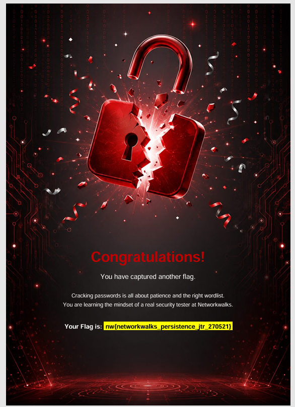
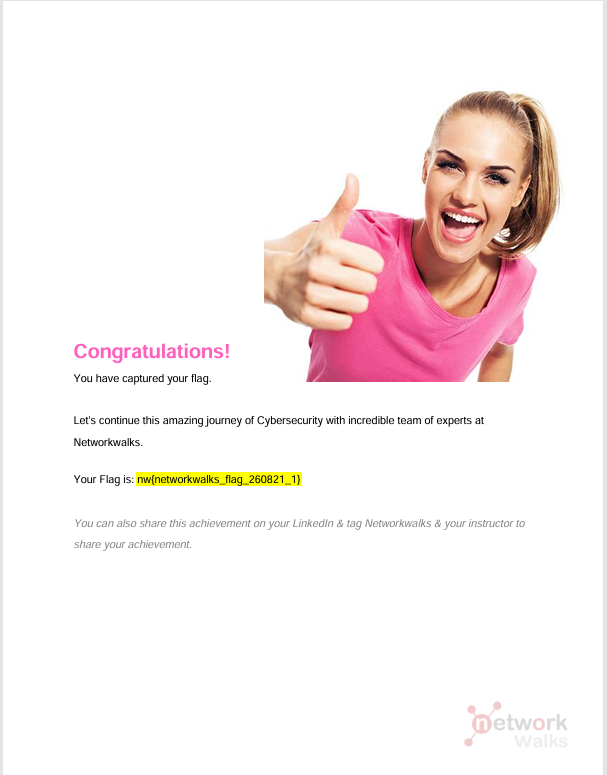

# NETWORKWALKS-B083-WK3-CYBERSECURITY-LAB-SETUP

# 🔐 Password Cracking Locked PDF — John the Ripper, Johnny GUI, NW Tools

## 🛠 Tools 

| Item | Detail |
|---|---|
| **John the Ripper** | v1.9.0-jumbo-1 (Win64 build) |
| **Johnny** | GUI for John the Ripper |
|**Online Hash Crack**| Web tool - extract the information needed from your PDF to convert it to a hash |
| **NetworkWalks Hash Calculator** | Web tool — generates MD5/SHA-1/SHA-256/SHA-384/SHA-512 and extracts crackable hashes from password-protected PDFs |
| **NetworkWalks Password Cracker** | Web tool — Hash every word in a wordlist and match it against a PDF password hash, the same idea John the Ripper uses |
|**JTR_default_password.txt** | Wordlist and password dictionaries commonly used in cybersecurity and ethical hacking |
| **Target files** |  `My Locked PDF1.pdf`,  `My Locked PDF2.pdf`, `My Locked PDF3.pdf`|


---

## 📑 1st Way - JTR 

### Installation and Setup
Download John the Ripper and the John GUI from the official website, run the setup file & install Johnny.

### Pointing Johnny to `john.exe`
Under **Settings**, the path to `run\john.exe` was configured. Johnny auto-detected: `John the Ripper 1.9.0-jumbo-1 [cygwin 64-bit x86_64 AVX2 AC]`.

### Extract Hash File using `Online Hash Crack`
Upload the locked PDF:  `My Locked PDF1.pdf`, `My Locked PDF2.pdf`, `My Locked PDF3.pdf`, and the crackable hashes will be displayed. Copy the hashes and paste to the `hash1.txt`, `hash2.txt`, and `hash3.txt`consecutively. 

### Importing the Hash & Cracking
Click on the **Open password file** and open a downloaded `$pdf$` hash file. After the attack ran, it displayed the recovered plaintext password directly in the **Password** column.

|Locked PDF File | Cracked Password | 
|---|---|
|My Locked PDF1.pdf | `good-luck` |
|My Locked PDF2.pdf | `password1` |
|My Locked PDF3.pdf | `1qaz2wsx` |

---


### 📑 2nd Way - NW Tools

### Upload the PDF & Extract Its Hash
On the **Hash Calculator** tool (PDF tab), upload the locked PDF file and copy the crackable hash displayed.

### Paste the Hash & Start the Attack
On the **Password Cracker through Dictionary Attacks** tool, the copied hash was pasted into the `PDF HASH ($PDF$...)` field. The **Upload wordlist (.txt)** button was clicked, and the wordlist file `JTR_default_password.txt` was uploaded. 
then **START CRACKING** was clicked. 


### Dictionary Attack in Progress → Match Found
The tool hashed each wordlist inside the uploaded file and found its matches. 

|Hash | Matched Password |
|---|---|
|`$pdf$4*4*128*-1028*1*16*ca7f72f11459cba469f1005a8765ed51*32*f32d8fa1bfbe2648226dffc39f7909ea0021446990b9e4114071a4d9104984c1*32*9322f50c29569712067a775264635e4954ccb1b99e209d664984054ffad30a6a`| `good-luck` |
|`$pdf$4*4*128*-1028*1*16*0853f2cde0ef15b1c0f93ed229d3b1ad*32*8f13ce5aa39ad974364d36a057da76790021446990b9e4114071a4d9104984c1*32*ceecdac74b19b5a62688d3b3524e1374c955cbb9cc3c45316494d9446ef81af1`| `password1` |
|`$pdf$4*4*128*-1028*1*16*34eb542eff4e1b0b32d25ce15a9a7281*32*b77872bfc9a24fb2f845066283a8fc1b0021446990b9e4114071a4d9104984c1*32*e7572256e4b552cd57988f5134214b91920d94d7a6bf550ea94a2995c7f2ab02` | `1qaz2wsx` |


### Unlocking the PDF & Capturing the Flag
The cracked password was used to open the locked file — it unlocked successfully, and the flag captured.

```
nw{cybersecurity_flag_captured_2608}
```


---

```
  
nw{networkwalks_persistence_jtr_270521}
```



---


```
nw{networkwalks_flag_260821_1}
```



---


# 👤 Author

**Vivi Hanna Handison**\
LinkedIn: [https://www.linkedin.com/in/vivihanna](https://www.linkedin.com/in/vivihanna)

## 📌 Project Information

**Program Name:** Cybersecurity at Networkwalks | **Week:** 03 | **Project:** Password Cracking for Locked PDF | **Repository:** GitHub
